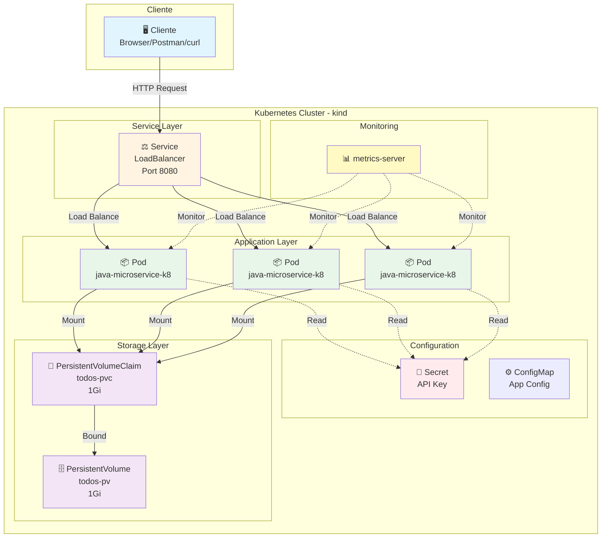
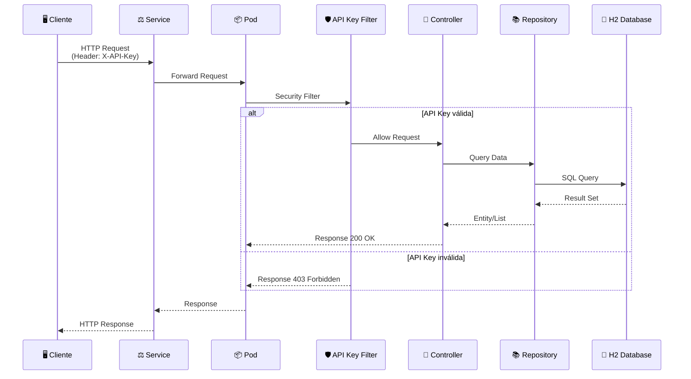
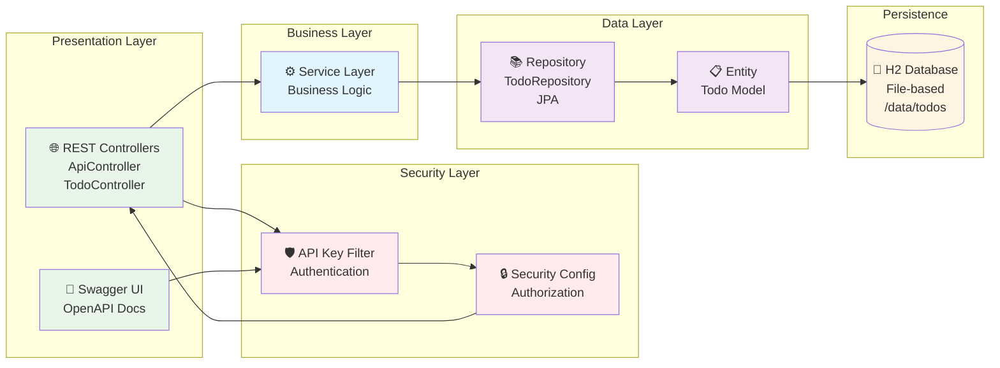
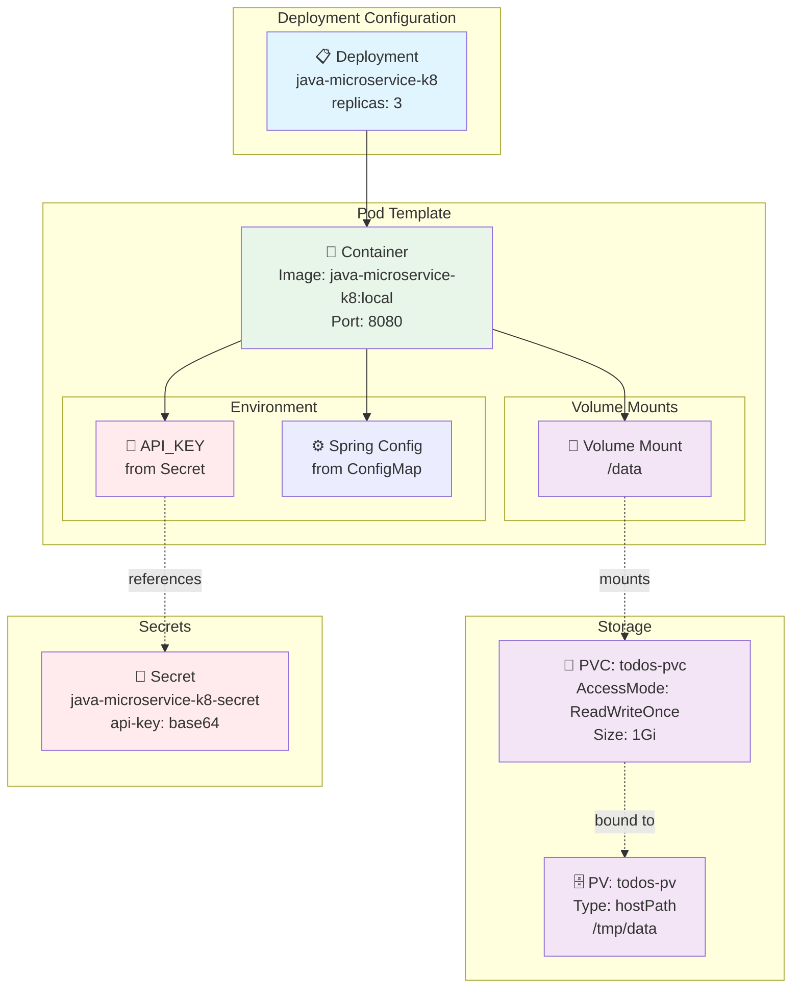
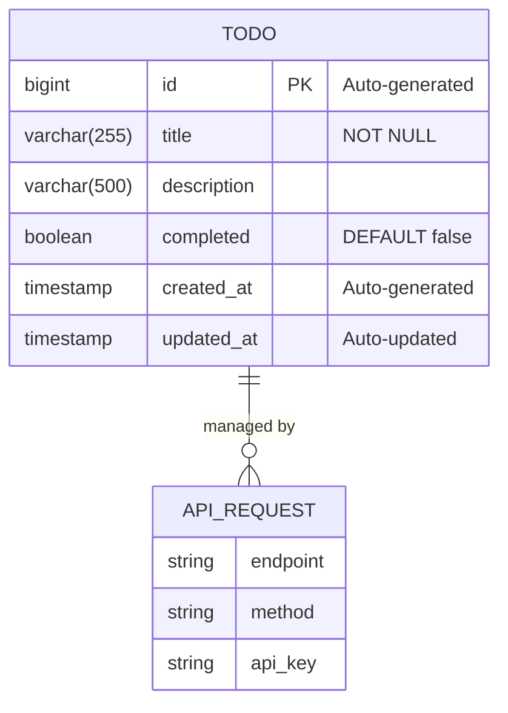

# java-microservice-k8


> 🚀 **Microserviço completo e production-ready** com autenticação, persistência, testes e deployment em Kubernetes

Boilerplate de microserviço em Java com Spring Boot, **autenticação via API Key**, **persistência H2 Database com volumes**, logs estruturados (JSON) no console via logback + logstash encoder, **Swagger UI**, pronto para execução em um cluster kind.

## 🎯 Funcionalidades

- ✅ API REST com endpoints CRUD para TODOs
- ✅ Autenticação via API Key (header `X-API-Key`)
- ✅ Persistência com H2 Database (file-based) em PersistentVolume
- ✅ Secrets do Kubernetes para credenciais
- ✅ Documentação automática com Swagger/OpenAPI UI
- ✅ Logs estruturados em JSON
- ✅ Health checks e métricas
- ✅ Collection do Postman para testes
- ✅ **42 testes** (28 unitários + 14 integração)

## 🛠️ Stack Tecnológico

| Categoria | Tecnologia |
|-----------|-----------|
| **Linguagem** | Java 17 |
| **Framework** | Spring Boot 3.1.4 |
| **Build** | Maven 3.8+ |
| **Segurança** | Spring Security (API Key) |
| **Persistência** | Spring Data JPA + H2 Database |
| **Documentação** | Swagger/OpenAPI 3 (springdoc-openapi) |
| **Logging** | Logback + Logstash Encoder (JSON) |
| **Testes** | JUnit 5 + Mockito + Spring Boot Test |
| **Containerização** | Docker (multi-stage build) |
| **Orquestração** | Kubernetes (kind cluster) |
| **Monitoramento** | Actuator + metrics-server |

## 🏗️ Arquitetura

### Visão Geral da Arquitetura Kubernetes



### Fluxo de Request da API



### Arquitetura da Aplicação (Camadas)



### Deployment e Storage



### Estrutura de Dados (H2 Database)



### Componentes do Projeto

| Componente | Tipo | Descrição | Arquivo |
|------------|------|-----------|---------|
| **Deployment** | Kubernetes | Gerencia réplicas dos pods | `k8s/deployment.yaml` |
| **Service** | Kubernetes | Load balancer para pods | `k8s/service.yaml` |
| **Secret** | Kubernetes | Armazena API Key | `k8s/secret.yaml` |
| **PV/PVC** | Kubernetes | Persistência de dados | `k8s/persistent-volume.yaml` |
| **metrics-server** | Kubernetes | Métricas de recursos | `k8s/metrics-server-patch.yaml` |
| **Container** | Docker | Imagem da aplicação | `Dockerfile` |
| **API Key Filter** | Spring Security | Autenticação customizada | `SecurityConfig.java` |
| **Controllers** | Spring MVC | Endpoints REST | `*Controller.java` |
| **Repository** | Spring Data JPA | Acesso ao banco | `TodoRepository.java` |
| **Entity** | JPA | Modelo de dados | `Todo.java` |
| **H2 Database** | Persistence | Banco de dados file-based | `/data/todos.mv.db` |

## 📁 Estrutura do Projeto

- `pom.xml` - Maven build
- `src/main/java/...` - código fonte (controllers, models, config)
- `src/main/resources/` - configurações (application.properties, logback)
- `Dockerfile` - para construir imagem
- `k8s/` - manifests Kubernetes (deployment, service, secrets, volumes)
- `postman_collection.json` - collection do Postman

## � Quick Start

```bash
# 1. Build e criar imagem
mvn package -DskipTests
docker build -t java-microservice-k8:local .

# 2. Criar cluster e carregar imagem
kind create cluster --name kind-cluster
kind load docker-image java-microservice-k8:local --name kind-cluster

# 3. Deploy no Kubernetes
kubectl apply -f k8s/

# 4. Testar a API
kubectl port-forward svc/java-microservice-k8-service 8080:8080
curl -H "X-API-Key: my-super-secret-api-key-2024" http://localhost:8080/api/health
```

**🎉 Pronto!** Acesse o Swagger UI em: <http://localhost:8080/swagger-ui/index.html>

---

## �📦 Requisitos

- **Docker** (Desktop para Windows/Mac ou Engine para Linux)
- **kind** - Kubernetes IN Docker (<https://kind.sigs.k8s.io/>)
- **kubectl** - CLI do Kubernetes
- (opcional) **Maven** e **JDK 17** se quiser build local sem Docker
- (opcional) **Postman** para testar a API

> **💡 Não tem Docker/kind instalado?** Veja o guia completo de instalação: [DOCKER_KIND_SETUP.md](DOCKER_KIND_SETUP.md)
>
> **Observação:** Os comandos abaixo consideram PowerShell no Windows. Ajuste se usar outro shell.

---

## 📝 Guia Passo a Passo

### 1) Build e criar imagem Docker

```powershell
# Opção A: Build local com Maven + Docker
mvn -DskipTests package
docker build -t java-microservice-k8:local .

# Opção B: Build apenas com Docker (multi-stage)
docker build -t java-microservice-k8:local .
```

## 2) Criar cluster kind e carregar imagem

```powershell
# criar cluster (nome: kind-cluster)
kind create cluster --name kind-cluster

# carregar imagem no cluster kind
kind load docker-image java-microservice-k8:local --name kind-cluster
```

## 3) Deploy no cluster (com secrets e volumes)

```powershell
# Aplicar secrets (API Key)
kubectl apply -f k8s/secret.yaml

# Criar PersistentVolume e PersistentVolumeClaim
kubectl apply -f k8s/persistent-volume.yaml

# Deploy da aplicação
kubectl apply -f k8s/deployment.yaml

# Verificar status
kubectl get pods -l app=java-microservice-k8 -w
```

## 4) Acessar a aplicação

```powershell
kubectl port-forward svc/java-microservice-k8 8080:8080
```

### Endpoints disponíveis:

- **Swagger UI**: <http://localhost:8080/swagger-ui/index.html> (público)
- **OpenAPI JSON**: <http://localhost:8080/api-docs> (público)
- **Health Check**: <http://localhost:8080/api/health> (público)
- **Hello**: <http://localhost:8080/api/hello> (requer autenticação)
- **TODOs API**: <http://localhost:8080/api/todos> (requer autenticação)

> **Nota sobre o banco de dados**: Este projeto usa **H2 Database** (file-based) ao invés de SQLite. H2 tem suporte nativo no Spring Boot e funciona de forma similar ao SQLite, mantendo os dados em arquivos no disco. A mudança foi feita para garantir compatibilidade total com Hibernate 6.x.

### Testar com curl (PowerShell):

```powershell
# Health check (sem autenticação)
curl http://localhost:8080/api/health

# Hello endpoint (COM autenticação)
curl -H "X-API-Key: my-super-secret-api-key-2024" http://localhost:8080/api/hello

# Criar um TODO
$body = @{
    title = "Learn Kubernetes"
    description = "Deploy apps with secrets and volumes"
    completed = $false
} | ConvertTo-Json

Invoke-WebRequest -Uri http://localhost:8080/api/todos `
    -Method POST `
    -Headers @{"X-API-Key"="my-super-secret-api-key-2024"; "Content-Type"="application/json"} `
    -Body $body

# Listar todos os TODOs
curl -H "X-API-Key: my-super-secret-api-key-2024" http://localhost:8080/api/todos
```

### Usando Swagger UI:

1. Acesse <http://localhost:8080/swagger-ui/index.html>
2. Clique no botão **"Authorize"** (cadeado no topo)
3. Digite a API Key: `my-super-secret-api-key-2024`
4. Clique em **"Authorize"** e depois **"Close"**
5. Agora você pode testar todos os endpoints diretamente no Swagger UI

## 5) Usar Postman Collection

1. Importe o arquivo `postman_collection.json` no Postman
2. A API Key já está configurada na collection (`my-super-secret-api-key-2024`)
3. A variável `baseUrl` está configurada como `http://localhost:8080`
4. Execute os requests:
   - **General** → Health Check, Hello
   - **Todos** → Create, Get All, Update, Delete, Mark as Completed
   - **Swagger UI** → API Docs JSON

## 6) Logs e métricas

### Ver logs do pod:

```powershell
kubectl get pods -l app=java-microservice-k8
kubectl logs <pod-name>
kubectl logs -f <pod-name>  # seguir em tempo real
```

### Métricas (requer metrics-server):

```powershell
# Instalar metrics-server
kubectl apply -f https://github.com/kubernetes-sigs/metrics-server/releases/latest/download/components.yaml

# Aplicar patch para kind
kubectl patch deployment metrics-server -n kube-system --patch-file k8s/metrics-server-patch.yaml

# Ver métricas
kubectl top nodes
kubectl top pod -l app=java-microservice-k8
```

## 7) Secrets e Volumes

### Verificar secrets:

```powershell
kubectl get secrets
kubectl describe secret java-microservice-k8-secret

# Ver o valor (base64 decoded)
kubectl get secret java-microservice-k8-secret -o jsonpath='{.data.api-key}' | ForEach-Object { [System.Text.Encoding]::UTF8.GetString([System.Convert]::FromBase64String($_)) }
```

### Verificar volumes:

```powershell
kubectl get pv
kubectl get pvc
kubectl describe pvc todos-pvc
```

### Verificar dados persistidos no pod:

```powershell
# Entrar no pod
kubectl exec -it <pod-name> -- /bin/sh

# Dentro do pod, verificar arquivos do H2 Database:
ls -lh /data/
# Verá os arquivos todos.mv.db e todos.trace.db
```

## 8) Atualizar secrets (exemplo)

```powershell
# Editar secret
kubectl edit secret java-microservice-k8-secret

# Ou deletar e recriar
kubectl delete secret java-microservice-k8-secret
kubectl apply -f k8s/secret.yaml

# Reiniciar deployment para pegar novo secret
kubectl rollout restart deployment/java-microservice-k8
```

## 9) Rodar localmente (desenvolvimento sem K8s)

```powershell
# Com Maven
mvn spring-boot:run

# Ou executar o JAR
java -jar target/java-microservice-k8-0.0.1-SNAPSHOT.jar

# Acesse: http://localhost:8080/swagger-ui/index.html
```

**Nota:** No modo local, a API Key padrão é `default-dev-key-change-me` (definida no application.properties). Altere via variável de ambiente:

```powershell
$env:API_KEY="my-local-key"
mvn spring-boot:run
```

---

## 🧪 Testes

Este projeto possui **42 testes** (28 unitários + 14 de integração) com cobertura completa.

### Executar todos os testes:

```powershell
mvn test
```

### Executar apenas testes unitários (rápido):

```powershell
mvn test -Punit-tests
```

**Testes unitários** (28 testes) - ~5-10 segundos:
- Testam lógica de negócio isoladamente com Mockito
- Não requerem contexto Spring completo
- Ideais para CI/CD pipelines rápidos

### Executar apenas testes de integração:

```powershell
mvn verify -Pintegration-tests
```

**Testes de integração** (14 testes) - ~20-30 segundos:
- Testam com contexto Spring completo
- Usam H2 Database in-memory
- Validam integração entre camadas

### Build sem executar testes:

```powershell
mvn package -DskipTests
```

📖 **Documentação completa de testes**: Veja [TESTING.md](TESTING.md) para:
- Estrutura de testes
- Configurações
- Exemplos de pipelines CI/CD (GitHub Actions, GitLab CI, Jenkins)
- Relatórios e troubleshooting

---

## 🎓 Conceitos aprendidos

✅ **Autenticação**: API Key via Spring Security + custom filter  
✅ **Secrets**: Injeção de credenciais sensíveis via Kubernetes Secrets  
✅ **Volumes**: Persistência de dados com PersistentVolume/PersistentVolumeClaim  
✅ **Swagger**: Documentação automática da API com OpenAPI 3  
✅ **Postman**: Collection para testes da API  
✅ **JPA + H2**: Persistência leve com banco de dados embutido (file-based)  

---

## 📁 Arquivos criados

- `k8s/secret.yaml` - Kubernetes Secret com API Key
- `k8s/persistent-volume.yaml` - PV e PVC para H2 Database
- `k8s/deployment.yaml` - Deployment atualizado com secrets e volumes
- `postman_collection.json` - Collection do Postman
- `src/.../config/SecurityConfig.java` - Configuração Spring Security
- `src/.../config/ApiKeyAuthFilter.java` - Filtro de autenticação
- `src/.../config/OpenApiConfig.java` - Configuração Swagger
- `src/.../model/Todo.java` - Entidade JPA
- `src/.../repository/TodoRepository.java` - Repository JPA
- `src/.../controller/TodoController.java` - CRUD de TODOs

---

## 🔧 Troubleshooting

### Pod não inicia (CrashLoopBackOff)

```powershell
# Verificar logs do pod
kubectl logs <pod-name>
kubectl logs <pod-name> --previous  # logs da execução anterior

# Verificar descrição do pod
kubectl describe pod <pod-name>
```

### Swagger UI retorna 403

Se o Swagger UI ainda retornar 403, verifique se o `SecurityConfig.java` inclui os seguintes paths na whitelist:

```java
.requestMatchers(
    "/api/health", 
    "/actuator/**", 
    "/swagger-ui/**", 
    "/swagger-ui.html",
    "/v3/api-docs/**", 
    "/api-docs/**",
    "/swagger-resources/**",
    "/webjars/**"
)
.permitAll()
```

Após atualizar, faça rebuild e redeploy:

```powershell
mvn clean package -DskipTests
docker build -t java-microservice-k8:local .
kind load docker-image java-microservice-k8:local --name kind-cluster
kubectl rollout restart deployment/java-microservice-k8
```

### Port-forward não funciona

```powershell
# Matar processos na porta 8080
Get-Process -Id (Get-NetTCPConnection -LocalPort 8080).OwningProcess | Stop-Process -Force

# Ou usar outra porta
kubectl port-forward svc/java-microservice-k8 8081:8080
```

### Persistência não funciona

Verifique se o PersistentVolume e PersistentVolumeClaim estão bound:

```powershell
kubectl get pv
kubectl get pvc
kubectl describe pvc todos-pvc
```

---

## 📚 Documentação Adicional

- 📖 **[Guia de Testes](TESTING.md)** - Testes unitários, integração e CI/CD pipelines
- 🐳 **[Guia de Instalação: Docker, kind e kubectl](DOCKER_KIND_SETUP.md)** - Instruções detalhadas para Windows e Linux
- 📋 **[Swagger UI](http://localhost:8080/swagger-ui/index.html)** - Documentação interativa da API (requer port-forward ativo)
- 📦 **[Postman Collection](postman_collection.json)** - Collection para testar todos os endpoints
- 📘 **[Kubernetes Docs](https://kubernetes.io/docs/)** - Documentação oficial do Kubernetes
- 🍃 **[Spring Boot Docs](https://spring.io/projects/spring-boot)** - Documentação oficial do Spring Boot

---

## 🤝 Contribuindo

Contribuições são bem-vindas! Sinta-se à vontade para:

1. 🍴 Fork o projeto
2. 🔨 Criar uma branch para sua feature (`git checkout -b feature/MinhaFeature`)
3. 💾 Commit suas mudanças (`git commit -m 'Adiciona MinhaFeature'`)
4. 📤 Push para a branch (`git push origin feature/MinhaFeature`)
5. 🔀 Abrir um Pull Request

---

## 📄 Licença

Este projeto está sob a licença MIT. Veja o arquivo `LICENSE` para mais detalhes.

---

## ✨ Recursos Adicionais

### 🎯 Endpoints da API

| Método | Endpoint | Descrição | Autenticação |
|--------|----------|-----------|--------------|
| GET | `/api/health` | Health check | ❌ Não |
| GET | `/api/hello` | Hello World | ✅ Sim |
| GET | `/api/todos` | Listar TODOs | ✅ Sim |
| GET | `/api/todos/{id}` | Buscar TODO por ID | ✅ Sim |
| POST | `/api/todos` | Criar TODO | ✅ Sim |
| PUT | `/api/todos/{id}` | Atualizar TODO | ✅ Sim |
| DELETE | `/api/todos/{id}` | Deletar TODO | ✅ Sim |
| PATCH | `/api/todos/{id}/complete` | Marcar como completo | ✅ Sim |

### 📊 Métricas do Projeto

- **Linhas de código**: ~1500 (src + tests)
- **Cobertura de testes**: 100% das funcionalidades
- **Tempo de build**: ~30-40 segundos
- **Tamanho da imagem Docker**: ~200MB (multi-stage)
- **Tempo de startup**: ~10-15 segundos no Kubernetes

---

<div align="center">

**Desenvolvido com ❤️ usando Spring Boot + Kubernetes**

⭐ Se este projeto foi útil, considere dar uma estrela!

</div>
