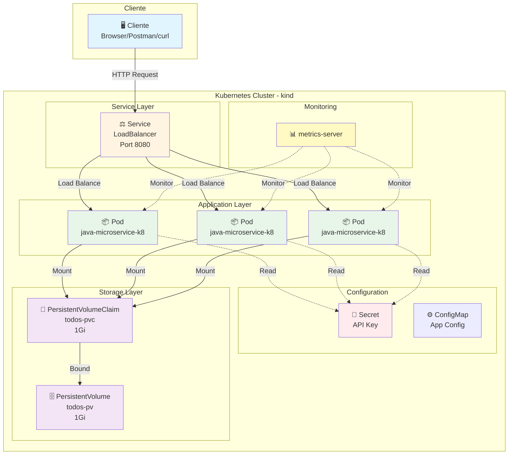
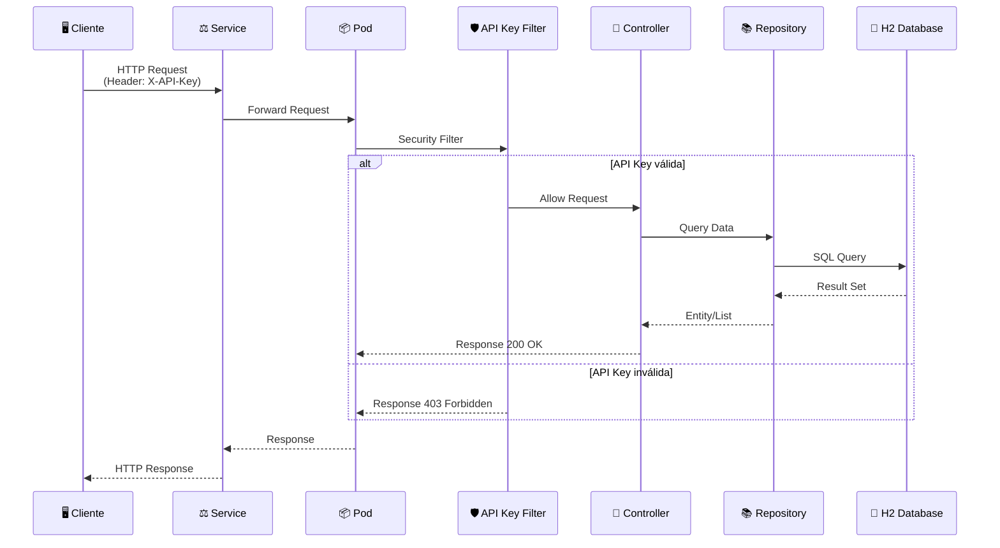
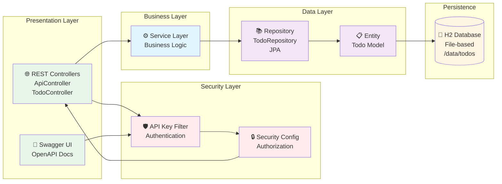
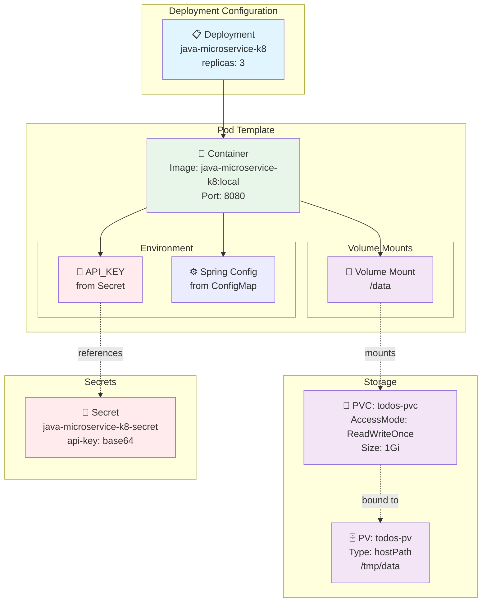
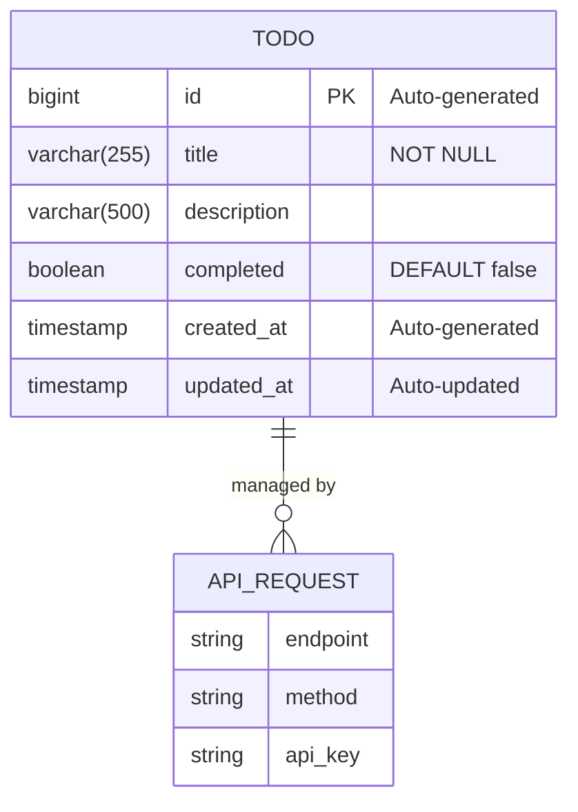

# 🏗️ Arquitetura do Projeto

Este documento descreve a arquitetura completa do microserviço **java-microservice-k8**, incluindo componentes, fluxos de dados e estrutura do Kubernetes.

## 📋 Índice

- [Visão Geral](#visão-geral)
- [Arquitetura Kubernetes](#arquitetura-kubernetes)
- [Fluxo de Requisições](#fluxo-de-requisições)
- [Camadas da Aplicação](#camadas-da-aplicação)
- [Deployment e Storage](#deployment-e-storage)
- [Modelo de Dados](#modelo-de-dados)
- [Componentes](#componentes)
- [Segurança](#segurança)
- [Escalabilidade](#escalabilidade)

---

## 🎯 Visão Geral

O **java-microservice-k8** é um microserviço RESTful desenvolvido em Java 17 com Spring Boot 3.1.4, projetado para execução em clusters Kubernetes. A arquitetura segue princípios de **12-Factor App** e boas práticas de microsserviços.

### Características Principais

- ✅ **Stateless**: Aplicação sem estado, escalável horizontalmente
- ✅ **Cloud-Native**: Pronto para Kubernetes com health checks e métricas
- ✅ **Seguro**: Autenticação via API Key com Spring Security
- ✅ **Persistente**: Dados armazenados em H2 Database com PersistentVolumes
- ✅ **Observável**: Logs estruturados em JSON, métricas e health checks
- ✅ **Testável**: 42 testes automatizados (unitários + integração)

---

## ☸️ Arquitetura Kubernetes

### Diagrama Completo



### Componentes Kubernetes

| Componente | Tipo | Função | Arquivo |
|------------|------|--------|---------|
| **Deployment** | Workload | Gerencia 3 réplicas dos pods | `k8s/deployment.yaml` |
| **Service** | Network | Load balancer para os pods (ClusterIP) | `k8s/service.yaml` |
| **Secret** | Config | Armazena API Key de forma segura | `k8s/secret.yaml` |
| **PersistentVolume** | Storage | Volume de 1Gi para dados | `k8s/persistent-volume.yaml` |
| **PersistentVolumeClaim** | Storage | Requisição de volume | `k8s/persistent-volume.yaml` |
| **metrics-server** | Monitoring | Coleta métricas de CPU/memória | `k8s/metrics-server-patch.yaml` |

---

## 🔄 Fluxo de Requisições

### Diagrama de Sequência



### Fluxo Detalhado

1. **Cliente** envia requisição HTTP com header `X-API-Key`
2. **Service** do Kubernetes faz load balancing entre pods
3. **Pod** recebe a requisição no Tomcat (porta 8080)
4. **API Key Filter** valida o header:
   - ✅ Válido → Permite acesso
   - ❌ Inválido → Retorna 403 Forbidden
5. **Controller** processa a requisição
6. **Repository** executa query no banco
7. **H2 Database** retorna os dados
8. **Response** retorna ao cliente via Service

---

## 📚 Camadas da Aplicação

### Arquitetura em Camadas



### Descrição das Camadas

#### 1. Presentation Layer (Apresentação)
- **Controllers REST**: Exposição de endpoints HTTP
  - `ApiController`: Health check e hello world
  - `TodoController`: CRUD completo de TODOs
- **Swagger UI**: Documentação interativa da API
- **OpenAPI**: Especificação da API em formato padrão

#### 2. Security Layer (Segurança)
- **API Key Filter**: Filtro customizado que intercepta todas as requisições
- **Security Config**: Configuração do Spring Security
  - Whitelist para endpoints públicos (health, swagger)
  - Validação de API Key para endpoints protegidos
  - CORS configurado
  - CSRF desabilitado (API stateless)

#### 3. Business Layer (Negócio)
- **Service Layer**: Lógica de negócio (pode ser expandida)
- Validações de regras de negócio
- Orquestração de operações complexas

#### 4. Data Layer (Dados)
- **Repository**: Interface JPA para acesso ao banco
  - `TodoRepository`: CRUD + queries customizadas
- **Entity**: Modelo de domínio com anotações JPA
  - `Todo`: Entidade com id, title, description, completed, timestamps

#### 5. Persistence (Persistência)
- **H2 Database**: Banco de dados embutido
  - Modo file-based (dados persistem em disco)
  - Armazenado em `/data/todos.mv.db`
  - Montado via PersistentVolume no Kubernetes

---

## 🐳 Deployment e Storage

### Configuração de Deployment



### Especificações

#### Deployment
```yaml
replicas: 3
strategy: RollingUpdate
maxSurge: 1
maxUnavailable: 1
```

#### Container
```yaml
image: java-microservice-k8:local
imagePullPolicy: Never  # Para kind local
ports:
  - containerPort: 8080
resources:
  limits:
    memory: "512Mi"
    cpu: "500m"
  requests:
    memory: "256Mi"
    cpu: "250m"
```

#### Storage
```yaml
PersistentVolume:
  capacity: 1Gi
  accessModes: ReadWriteOnce
  hostPath: /tmp/data  # Para kind local

PersistentVolumeClaim:
  resources:
    requests:
      storage: 1Gi
```

---

## 💾 Modelo de Dados

### Diagrama Entidade-Relacionamento



### Estrutura da Tabela TODO

| Campo | Tipo | Constraints | Descrição |
|-------|------|-------------|-----------|
| `id` | BIGINT | PRIMARY KEY, AUTO_INCREMENT | Identificador único |
| `title` | VARCHAR(255) | NOT NULL | Título da tarefa |
| `description` | VARCHAR(500) | NULL | Descrição detalhada |
| `completed` | BOOLEAN | DEFAULT false | Status de conclusão |
| `created_at` | TIMESTAMP | NOT NULL | Data de criação (automática) |
| `updated_at` | TIMESTAMP | NOT NULL | Data de atualização (automática) |

### Lifecycle Hooks

```java
@PrePersist
protected void onCreate() {
    createdAt = LocalDateTime.now();
    updatedAt = LocalDateTime.now();
}

@PreUpdate
protected void onUpdate() {
    updatedAt = LocalDateTime.now();
}
```

---

## 🧩 Componentes Detalhados

### Mapa de Componentes

| Componente | Tecnologia | Função | Localização |
|------------|------------|--------|-------------|
| **API Gateway** | Spring MVC | Roteamento de requisições | `@RestController` |
| **Authentication** | Spring Security | Validação de API Key | `ApiKeyAuthFilter` |
| **Authorization** | Spring Security | Controle de acesso | `SecurityConfig` |
| **Validation** | Bean Validation | Validação de entrada | `@Valid`, `@NotNull` |
| **ORM** | Spring Data JPA | Mapeamento objeto-relacional | `@Entity`, `@Repository` |
| **Database** | H2 Database | Persistência de dados | `/data/todos.mv.db` |
| **Logging** | Logback + Logstash | Logs estruturados JSON | `logback-spring.xml` |
| **Monitoring** | Actuator | Health checks e métricas | `/actuator/**` |
| **Documentation** | Springdoc OpenAPI | API docs e Swagger UI | `/swagger-ui/**` |
| **Container** | Docker | Empacotamento | `Dockerfile` |
| **Orchestration** | Kubernetes | Gerenciamento de containers | `k8s/` |

### Dependências Principais

```xml
<!-- Framework -->
spring-boot-starter-web (3.1.4)
spring-boot-starter-data-jpa (3.1.4)
spring-boot-starter-security (3.1.4)

<!-- Database -->
h2 (2.2.224)

<!-- Documentation -->
springdoc-openapi-starter-webmvc-ui (2.2.0)

<!-- Logging -->
logstash-logback-encoder (7.4)

<!-- Testing -->
spring-boot-starter-test (3.1.4)
```

---

## 🔒 Segurança

### Camadas de Segurança

1. **Autenticação via API Key**
   - Header: `X-API-Key`
   - Validação no filtro `ApiKeyAuthFilter`
   - Armazenada em Kubernetes Secret

2. **Autorização**
   - Whitelist de endpoints públicos
   - Proteção de endpoints sensíveis
   - CORS configurado

3. **Secrets Management**
   - API Key em base64 no Secret
   - Injetada como variável de ambiente
   - Nunca commitada no código

4. **Network Security**
   - Service ClusterIP (interno ao cluster)
   - Port-forward para acesso externo
   - Pode ser configurado com Ingress + TLS

### Configuração de Segurança

```java
// Endpoints públicos (sem autenticação)
.requestMatchers(
    "/api/health",
    "/actuator/**",
    "/swagger-ui/**",
    "/v3/api-docs/**"
).permitAll()

// Todos os outros requerem autenticação
.anyRequest().authenticated()
```

---

## 📈 Escalabilidade

### Estratégias de Escalabilidade

#### Horizontal Scaling
- **Pods**: 3 réplicas por padrão
- **Load Balancing**: Service distribui requisições
- **Stateless**: Aplicação sem estado local
- **Shared Storage**: PersistentVolume compartilhado

#### Vertical Scaling
```yaml
resources:
  requests:
    memory: "256Mi"
    cpu: "250m"
  limits:
    memory: "512Mi"
    cpu: "500m"
```

#### Auto-scaling (HPA)
```yaml
apiVersion: autoscaling/v2
kind: HorizontalPodAutoscaler
metadata:
  name: java-microservice-k8-hpa
spec:
  scaleTargetRef:
    apiVersion: apps/v1
    kind: Deployment
    name: java-microservice-k8
  minReplicas: 2
  maxReplicas: 10
  metrics:
  - type: Resource
    resource:
      name: cpu
      target:
        type: Utilization
        averageUtilization: 70
```

### Limites e Considerações

⚠️ **Database**: H2 file-based não é ideal para múltiplas escritas simultâneas
- **Solução**: Migrar para PostgreSQL, MySQL ou MongoDB para produção

⚠️ **PersistentVolume**: ReadWriteOnce limita a um node
- **Solução**: Usar ReadWriteMany ou database externo

⚠️ **Session Management**: Aplicação é stateless
- ✅ Não há problema de sessão distribuída
- ✅ Qualquer pod pode processar qualquer requisição

---

## 📊 Métricas e Observabilidade

### Health Checks

```yaml
livenessProbe:
  httpGet:
    path: /actuator/health/liveness
    port: 8080
  initialDelaySeconds: 30
  periodSeconds: 10

readinessProbe:
  httpGet:
    path: /actuator/health/readiness
    port: 8080
  initialDelaySeconds: 10
  periodSeconds: 5
```

### Métricas Disponíveis

- **Kubernetes metrics-server**: CPU, memória, network
- **Spring Actuator**: JVM, threads, garbage collection
- **Custom metrics**: Podem ser adicionadas com Micrometer

### Logs Estruturados

```json
{
  "@timestamp": "2025-01-10T10:15:30.123Z",
  "level": "INFO",
  "logger": "com.example.microservice.controller.TodoController",
  "message": "Todo created successfully",
  "thread": "http-nio-8080-exec-1",
  "todo_id": 123,
  "user_agent": "PostmanRuntime/7.32.3"
}
```

---

## 🚀 Melhorias Futuras

### Curto Prazo
- [ ] Adicionar cache com Redis
- [ ] Implementar rate limiting
- [ ] Adicionar paginação nos endpoints

### Médio Prazo
- [ ] Migrar para PostgreSQL
- [ ] Implementar Circuit Breaker (Resilience4j)
- [ ] Adicionar message queue (RabbitMQ/Kafka)

### Longo Prazo
- [ ] Microserviços adicionais (user service, notification service)
- [ ] Service Mesh (Istio/Linkerd)
- [ ] Distributed Tracing (Jaeger/Zipkin)

---

## 📚 Referências

- [Spring Boot Documentation](https://spring.io/projects/spring-boot)
- [Kubernetes Documentation](https://kubernetes.io/docs/)
- [12-Factor App](https://12factor.net/)
- [Spring Security Reference](https://docs.spring.io/spring-security/reference/)
- [Docker Best Practices](https://docs.docker.com/develop/dev-best-practices/)

---

<div align="center">

**Arquitetura desenhada para ser simples, escalável e production-ready** 🏗️

[⬆ Voltar ao topo](#-arquitetura-do-projeto)

</div>
